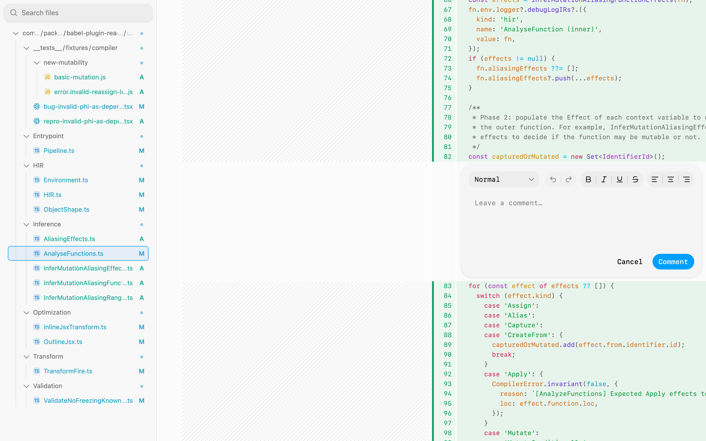

# better-diffs

Share your current changes with teammates without creating a PR. Teammates can view the diff and leave comments.

<picture>
  <source
    media="(prefers-color-scheme: dark)"
    srcset="docs/annotation-form-dark.png"
  />
  <source
    media="(prefers-color-scheme: light)"
    srcset="docs/annotation-form-light.png"
  />
  
</picture>

## How it works

A CLI generates a shareable URL for your local changes. The link expires after one day from the last visit.
